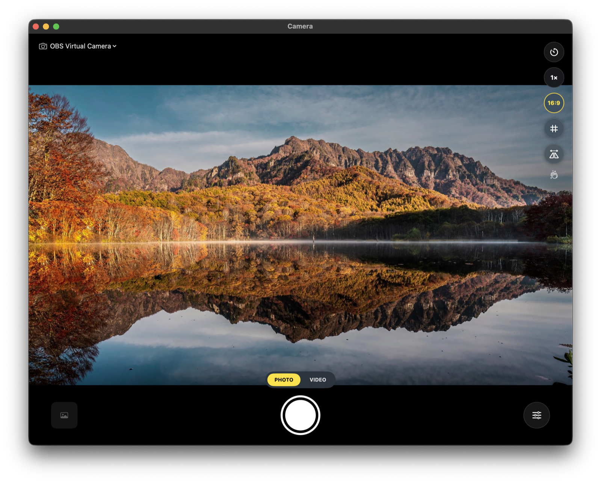

# Camera


A lightweight, iOS-style **Camera** app for macOS — the simple "just open a camera"
utility that macOS never shipped. Fast launch, live preview, one-tap shutter,
photo + video, Continuity Camera (use your iPhone), and a menu-bar quick-check.

Built with SwiftUI + AVFoundation. No full Xcode required — compiles with the
Command Line Tools toolchain.

## Features

- **Full-bleed live preview** with floating, iOS-style glass controls.
- **Photo mode** — one-tap shutter (or press `Space`), saved to `~/Pictures`.
- **Video mode** — tap to record / stop, live recording timer, saved to `~/Movies` (with mic audio).
- **Continuity Camera** — detects your iPhone and any external cameras; switch
  from the glass menu in the top-left.
- **Adaptive camera controls** — the control column only shows what the *active*
  camera actually supports:
  - **Exposure lock**, **focus lock**, **white-balance lock**
  - **Tap-to-focus** — click anywhere on the preview to set focus/exposure point
  - **Center Stage** toggle (iPhone / supported Macs)
  - **Reaction effects** (macOS 14+ — hearts, confetti, thumbs-up, …)
  - **Mirror** the preview
- **Digital zoom** — pinch, scroll, or tap the zoom button (up to 6× depending
  on the camera's native resolution). Photos are cropped to exactly match the
  preview.
- **Aspect ratio** — Full / 16:9 / 4:3 / 1:1 with iOS-style dimmed framing;
  saved photos match the visible window.
- **Self-timer** — cycle Off / 3s / 10s with an on-screen countdown.
- **Rule-of-thirds grid** overlay.
- **Capture flash** and a **thumbnail** of your last shot (click → reveal in Finder).
- **Menu-bar quick check** — instant live preview from the menu bar (Hand Mirror-style).
- **Settings window** (⌘,) — self-timer, grid, mirror, shutter sound, video
  quality, photo format (JPEG/HEIF), and custom save folders.

### Why no manual ISO / shutter / zoom?

macOS marks these `API_UNAVAILABLE(macos)` on capture devices — Apple doesn't
expose manual exposure duration, ISO, EV bias, or *device* zoom for Mac
capture (verified against the macOS 26 SDK headers). Zoom here is therefore
digital: a centered crop applied identically to the preview and saved photos.
Everything else is capability-driven — the app queries what your camera
supports and shows exactly those controls.

## Screenshots

The main window — full-bleed preview with the floating glass controls. Here with a
**16:9 aspect-ratio** crop active (dimmed masks show what's excluded) and the
**zoom** control at 1×, streaming from a virtual camera:



The **menu-bar quick check** — a live preview one click away, with instant
snapshot and a jump into the full app:


## Build & run

### In Xcode (recommended)

```sh
open Camera.xcodeproj
```

Then press **⌘R**. The project builds and runs locally with "Sign to Run Locally"
— no paid Apple Developer account required. On first launch macOS asks for
camera (and microphone) access — click **Allow**.

The project is generated from [`project.yml`](project.yml) with
[XcodeGen](https://github.com/yonwoo9/XcodeGen). `project.yml` is the source of
truth — after editing it (or adding files), regenerate with:

```sh
xcodegen generate
```

### Without Xcode (Command Line Tools only)

`build.sh` compiles the same sources into `build/Camera.app` using just the
Command Line Tools — handy if you don't have full Xcode installed:

```sh
./build.sh
open build/Camera.app
```

## Roadmap / Ideas

Contributions welcome — these are researched-but-unbuilt ideas, roughly ordered:

- **Screen flash** — flood the display white as fill light (the iPhone's torch
  is not exposed to macOS; verified at runtime).
- Zoom/aspect crop for **recorded video** (needs an `AVAssetWriter` pipeline
  to replace `AVCaptureMovieFileOutput`).
- Burst mode · GIF/clip capture · Core Image filters
- Session gallery strip · share menu from the thumbnail
- Global snap hotkey · `camera://snap` URL scheme
- Countdown sounds · gesture/smile trigger (Vision)
- Video pause/resume · codec (HEVC/H.264) and fps pickers
- Desk View window · floating picture-in-picture preview
- Watermark / timestamp overlay

## Project layout

| Path | Role |
|------|------|
| `Sources/CameraApp.swift` | App entry: main window + `MenuBarExtra` quick check |
| `Sources/CameraController.swift` | `AVCaptureSession`, device discovery, photo/video capture |
| `Sources/CameraPreview.swift` | `AVCaptureVideoPreviewLayer` bridged into SwiftUI |
| `Sources/ContentView.swift` | iOS-style camera UI (shutter, mode picker, thumbnail) |
| `Sources/MenuBarView.swift` | Compact menu-bar preview popover |
| `Sources/CaptureGeometry.swift` | Pure zoom/aspect crop math (unit-tested) |
| `Resources/Info.plist` | Bundle metadata + camera/mic usage strings |
| `project.yml` | XcodeGen spec — source of truth for `Camera.xcodeproj` |
| `Camera.xcodeproj` | Generated Xcode project (open with `⌘R` to run) |
| `build.sh` | Compiles sources into `build/Camera.app` without Xcode |
| `Tests/` + `test.sh` | CLT-only unit tests for the geometry code |
| `scripts/make-icon.sh` | Regenerates `Resources/AppIcon.icns` programmatically |

## Scope (deliberate)

This is a *simple* camera, not a pro tool. It intentionally skips manual
ISO/exposure/focus controls — built-in Mac webcams largely lack the hardware for
them, so the value here is speed and familiarity, not pro features.

## Requirements

- macOS 14.0+ (Continuity Camera / `.continuityCamera` device type)
- Xcode Command Line Tools (`xcode-select --install`)

## License

MIT — see [LICENSE](LICENSE).
